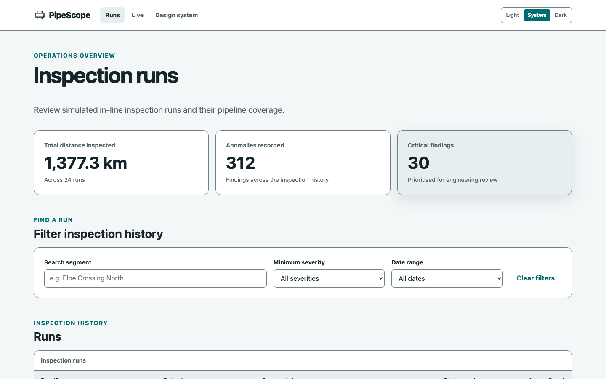

## Zero change detection at 40 Hz

*Misconception: Streaming 40 Hz sensor data through an Angular app means change detection is grinding on every frame.*

PipeScope runs on Angular 22's zoneless scheduler with `OnPush` components and signal-based state throughout.

There is no zone.js in the application, so nothing patches timers or event handlers to poll the component tree for changes.

The 40 Hz telemetry stream in `core/telemetry.ts` is the only RxJS surface, and `toSignal` bridges it to the stat readouts so a new frame updates exactly the templates that read it.

The ultrasound canvas subscribes to the stream directly, fills a ring buffer, and draws oscilloscope-style traces with a persistence trail inside a `requestAnimationFrame` loop.

Under zoneless change detection that loop triggers no change-detection cycle at all, which is the reason the drawing stays imperative and outside Angular's reactive graph.

The live monitor prints its own measured draw rate in the stream-health line, so the 60+ fps figure is a number you can watch in the running app rather than a benchmark taken once.

## Accessible down to the anomaly

*Misconception: Real-time canvas and SVG dashboards are a lost cause for keyboards and screen readers.*

The pipeline map is SVG precisely because anomaly markers deserve semantic DOM: each marker is a `role="button"` with a label like "Metal loss, high severity, at 3,240 m".

The markers form a roving tabindex: Arrow keys walk the pipeline in distance order, Home and End jump to the ends, Enter and Space select.

Every visualization has a text alternative: the map renders the same anomalies through an accessible sortable table, and the heatmap canvas is `role="img"` with a description that names its peak amplitude cell.

The live stream narrates itself through a visually-hidden live region throttled to roughly two seconds, beside a latest-readings table behind a disclosure.

When `prefers-reduced-motion` is set, the monitor starts paused with an explanatory note instead of auto-animating.

Severity is always expressed with text and marker shape as well as color, and forced-colors mode keeps borders and focus rings intact.

The design-system page computes the contrast ratio of every token pair in the active theme at runtime and prints the measured values next to the swatches, which is where the 4.5:1 figure in the stats comes from.

## The same world on every reload

*Misconception: A dashboard this alive needs a backend, or at least Math.random(), behind it.*

Every run, anomaly, heatmap, and telemetry frame derives from one constant: `PIPESCOPE_SEED` feeding a `mulberry32` generator in `core/random.ts`.

The generators in `core/inspection-data.ts` are pure functions, so the same seed always yields the same 24 runs with plausible physics - velocities, pressures, and severity correlated with wall-loss depth.

Anomalies are derived lazily per run from a seed based on the run id and cached in the NgRx SignalStore.

Reload the app and the world is identical, which is what makes the screenshots reproducible and lets end-to-end tests navigate to a run that is guaranteed to exist.

The unit suite asserts exactly that: same seed, same output, and the physics invariants hold.

## Canvas or SVG

The waveform redraws a 128-sample trace plus a trail of recent frames at display cadence, and doing that with DOM nodes would mean rebuilding a large tree dozens of times per second - so it is a canvas.

The anomaly heatmap draws a fixed 32 by 24 amplitude grid the same way.

The pipeline map holds a small set of markers that benefit from focus, roles, and labels - so it is SVG owned by Angular templates, while `d3-scale` supplies the distance math and never touches the DOM.

The rule of thumb the project demonstrates: pick the rendering technology per surface by update rate and semantic weight, not per app.

## Verified end to end

Every push runs lint, unit tests, a production build that fails on any warning, and Playwright end-to-end flows against the built artifact.

The deploy step then uploads that exact artifact to Azure Static Web Apps, so the version at pipescope.nqvinh.tech is the one that passed the suite, not a rebuild.

The end-to-end flows cover the keyboard path through the pipeline map, filtering and sorting the runs table, the live stream's frame counter advancing, and theme persistence across reload.

The site serves under the same preload-listed HSTS domain as this portfolio, with a content security policy and a one-year strict-transport policy.

## The result

The application is deliberately small enough to read end to end, and every architectural claim above is observable in the running app or enforced by the pipeline.

Signals own the state, RxJS owns the one true stream, the canvas owns its frame budget, and the seed owns the data.
